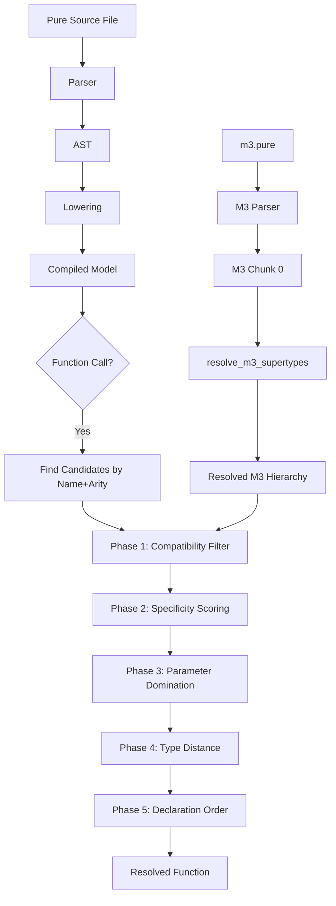

# Generic Dispatch Engine — Summary

## Overview

The Legend Pure compiler requires a **function dispatch engine** to resolve overloaded function calls at compile time. In Pure, functions can have multiple overloads with different parameter types (e.g., `elementToPath(Type)` vs `elementToPath(PackageableElement)` vs `elementToPath(Function<Any>)`). The compiler must pick the correct overload based on the argument types at each call site.

This document summarizes the implementation, validation approach, and remaining challenges.

---

## What We Built

### 1. M3 Metamodel Parser Corrections

The M3 metamodel (`m3.pure`) defines the core type hierarchy — `Class`, `Type`, `PackageableElement`, `Function`, etc. Our parser had a critical bug: in m3.pure, `Type.properties[generalizations]` stores generalization entries for **all subclasses** of `Type` (Class, PrimitiveType, DataType, etc.), not just `Type` itself. Each entry has a `specific` field identifying which class the generalization belongs to.

**Fix**: Modified `parse_generalization_instance()` to extract both `general` (supertype) and `specific` (subclass), then filter by `specific == current_class_name`.

**Result** — Correct M3 hierarchy:
```
Class → Type, PropertyOwner, ElementWithConstraints, PackageableElement, Testable
PrimitiveType → DataType, PackageableElement
Enumeration → DataType, PackageableElement
Measure → DataType, PackageableElement
DataType → Type
Type → Any
PackageableElement → ModelElement, Referenceable
Function → Referenceable
```

**Files**: `crates/pure/src/m3_parser.rs` (parse_generalizations, parse_generalization_instance)

### 2. M3 Supertype Resolution Pass

After M3 parsing, supertypes are stored as unresolved `TypeExpr::Generic("ClassName")` strings. A post-parse pipeline pass converts these to `TypeExpr::Named { element: ElementId }` — enabling the `is_subtype()` function to walk the hierarchy.

**Files**: `crates/pure/src/pipeline.rs` (resolve_m3_supertypes)

### 3. Metatype Inference for Element References

When a bare element name appears in value position (e.g., `MyClass`, `Number`, `MyEnum`), the compiler infers its M3 metatype:

| Element Kind | Inferred Metatype |
|---|---|
| Class | `meta::pure::metamodel::type::Class` |
| Enumeration | `meta::pure::metamodel::type::Enumeration` |
| PrimitiveType | `meta::pure::metamodel::type::PrimitiveType` |
| Function | `meta::pure::metamodel::function::ConcreteFunctionDefinition` |
| Measure | `meta::pure::metamodel::type::Measure` |
| Unit | `meta::pure::metamodel::type::Unit` |
| Package | `meta::pure::metamodel::PackageableElement` |

**Files**: `crates/pure/src/resolve.rs` (infer_type_from_valuespec → PackageableElementRef branch)

### 4. Five-Phase Dispatch Engine

The `narrow_candidates_by_type()` function resolves overloaded calls through five phases:

#### Phase 1: Compatibility Filter
Remove overloads where the argument type is incompatible with the parameter type. Uses `is_type_compatible()` (subtype check) and `is_multiplicity_compatible()`.

#### Phase 2: Specificity Scoring
Score remaining candidates per-parameter. Scores are *summed*, not
prioritized — higher total wins. The exact table, mirroring
`narrow_candidates_by_type` in `resolve.rs`:

| Dimension | Condition | Score |
|---|---|---|
| Type | Exact match (arg type == param element) | +3 |
| Type | Subtype match (arg type <: param element) | +1 |
| Type | Compatible via `Any` or a generic var | +0 |
| Mult | Exact match (arg mult == param mult) | +4 |
| Mult | Compatible but not exact | +mult_specificity (1–4) |
| Mult | Unknown arg mult | +mult_specificity (1–4) |
| Lambda | Arg is Lambda, param is `Function<{…→V[m]}>` | +3 and +mult_specificity(m) |
| Concrete | Arg is non-lambda, param is non-Function | +2 |

`mult_specificity`: `[1]` = 4, `[0..1]` / bounded `Range` = 3,
`[1..*]` = 2, `[*]` / unbounded / `Variable` = 1.

#### Phase 3: Parameter Domination
Among tied candidates, eliminate any overload whose parameter types are all supertypes of another candidate's parameters. E.g., `f(Type)` dominates `f(Any)` because `Type <: Any`.

#### Phase 4: Argument-Type Proximity
When Phase 3 leaves ties (independent branches), compute the shortest type-distance from each argument type to each candidate's parameter type using `type_distance()`. Pick the overload with the smallest total distance.

Example: For `PrimitiveType` argument:
- Distance to `Type`: PrimitiveType → DataType → Type = **2 hops**
- Distance to `PackageableElement`: PrimitiveType → PackageableElement = **1 hop**
- Picks `PackageableElement` (shorter distance)

#### Phase 5: Declaration-Order Tiebreaker
When all other phases produce ties (e.g., `Class` is equidistant to both `Type` and `PackageableElement`), pick the first-declared overload. This matches Java Pure compiler behavior.

**Files**: `crates/pure/src/resolve.rs` (narrow_candidates_by_type, is_subtype, type_distance)

### 5. Parser Fixes

Four parser bugs were fixed to handle edge cases in the platform source:

| Bug | Pattern | Fix |
|---|---|---|
| Type variable vs property assignment | `^Class(10)()` | Check `RParen` at `lookahead == 1` only for truly empty `()` |
| Constraint message concatenation | `~message:'Error ' + $x` | Always use `parse_expression()` for `~message` values |
| Multiplicity type arguments | `^MyClass<\|1>(...)` | Handle `\|` inside `<...>` as multiplicity argument |
| UnitInstance expressions | `5 RomanLength~Pes` | Added `UnitInstanceExpr` AST node + parser look-ahead |

**Files**: `crates/parser/src/parser/expression.rs`, `crates/parser/src/parser/class.rs`

---

## How We Validate

### 1. Unit Test Suite
```bash
cargo test
```
All existing tests pass (20+ tests across 6 crate test suites). Tests cover parsing, composition, protocol conversion, and compilation.

### 2. Platform Compilation
```bash
cargo run -- compile /path/to/legend-pure-core/.../platform/pure/
```
The primary validation target — compiles the **full Legend Pure M3 platform** (~350 source files, ~2,000+ elements). This exercises every path through the dispatch engine.

**Progress**: 2,164 errors → **8 errors** (99.6% reduction)

### 3. Error Categorization
We track errors by category to ensure each fix targets the right root cause:
```bash
cargo run -- compile ... 2>&1 | grep "✗" | sed 's/.*✗ //' | sed 's/ at .*//' | sort | uniq -c | sort -rn
```

### 4. Clippy + Format
```bash
cargo clippy --all-targets
cargo fmt --check
```

---

## Generic Type & Multiplicity Substitution

When dispatching a call whose arguments include values bound from a prior
generic-returning call (e.g., `let c_any = X->cast(@Class<Any>)`), the
dispatcher substitutes generic parameters (`T`, `m`) in the declared return
type using bindings inferred from the call-site arguments.

Implemented in `resolve.rs`:

- `infer_generic_bindings(params, args, …)` walks `(param, arg)` pairs,
  binding `Generic(name)` params to the arg's `TypeExpr` and
  `Multiplicity::Variable(name)` params to the arg's `Multiplicity`.
- `bind_type` recurses through `Named { type_arguments }` so
  `List<T>` vs `List<String>` binds `T := String`.
- `substitute_type` / `substitute_mult` rewrite a return type/mult using
  the bindings, recursing into nested `Named` / `FunctionType` /
  `AlgebraUnion` nodes.

Called in two places:
- `lower.rs::infer_let_type` for let-binding types.
- `resolve.rs::infer_type_from_valuespec` / `infer_multiplicity_from_valuespec`
  for nested call expressions.

`cast<T|m>(source:Any[m], object:T[1]):T[m]` with
`source=ClassWithDefault, object=@Class<Any>` binds
`T := Class<Any>, m := PureOne`, yielding `(Class<Any>, PureOne)` as the
call's result type.

## Status

All 8 challenges originally tracked in this document are closed. Platform
compile reports 0 errors against
`legend-pure-core/legend-pure-m3-core/src/main/resources/platform/pure/`.

---

## Architecture Diagram



---

## Key Files

| File | Purpose |
|---|---|
| `crates/pure/src/resolve.rs` | Dispatch engine, type compatibility, subtype checking |
| `crates/pure/src/pipeline.rs` | Compilation pipeline, M3 supertype resolution pass |
| `crates/pure/src/m3_parser.rs` | M3 metamodel parser, generalization extraction |
| `crates/pure/src/lower.rs` | Expression lowering, type inference for let-bindings |
| `crates/pure/src/bootstrap.rs` | Bootstrap element IDs and M3 initialization |
| `crates/parser/src/parser/expression.rs` | Expression parser (new-instance, type args) |
| `crates/parser/src/parser/class.rs` | Class/constraint parser |
